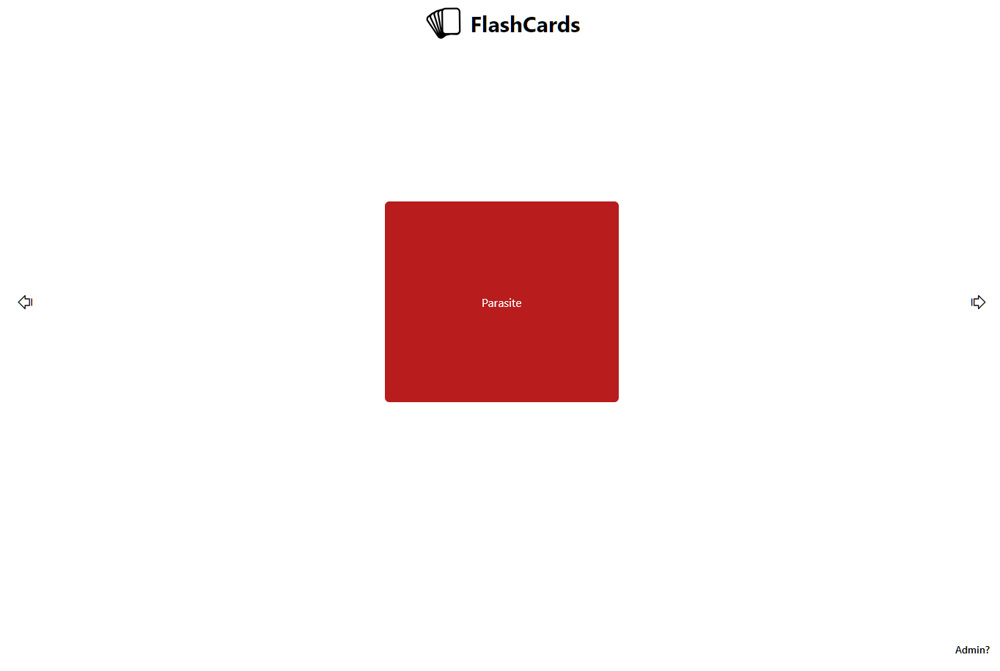
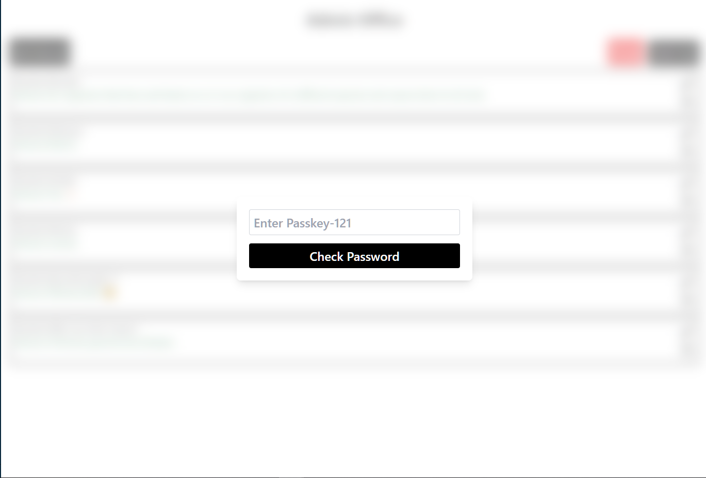
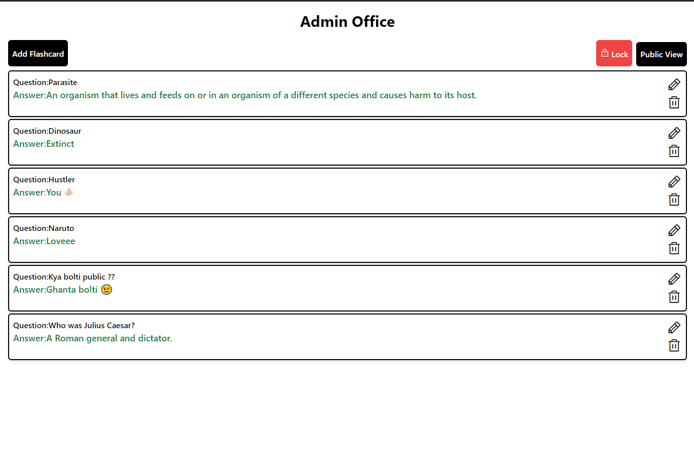

# FlashCard Learning

Made a single page react based FlashCard Learning website were admin can update flash card which are getting stored in MySql database. And are being fetched accordingly.Admin has to enter passkey to acess admin page. Didn't use any authetication excpet this. You can view the website at 

TechStack used: ReactJs , ExpressJs , MySql


## Screenshots
This is how public page looks which anybody can access



This is how admin page looks 




## Installation

How to setup? Run the following commands in terminal to clone the repo & run
---
Frontend setup
---
```bash
git clone "https://github.com/MrPurushotam/Flashcard"
cd Flashcard/frontend
cp .env.example .env
npm install
npm run dev
```

Backend setup
---
```bash
cd Flashcard/backend
cp .env.example .env
npm install
npm run start
```
Note: Update your keys accordingly

    
## Environment Variables

To run this project, you will need to add the following environment variables to your ./backend/.env file 

`MySql DB`

`Frontend Url`

And to run frontend you will need following variables (passkey is any key of your choice )

`Passkey`

`Backend Url`